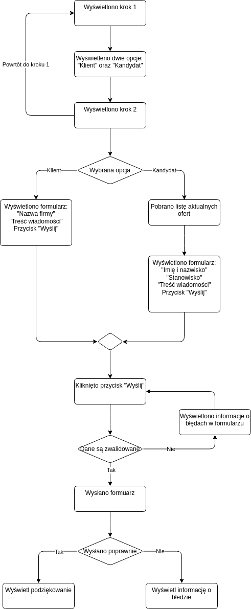

# Zadanie rekrutacyjne JavaScript Developer - RekinySukcesu.pl
## Wprowadzenie
Wyobraź sobie, że jako JavaScript Developer w naszej firmie dostałeś kod do przeprowadzenia code review.
Autorem kodu jest dzielny Zuch Stażysta.
Podczas wykonania swojego zadania starał się najlepiej ze swoich sił napisać kod w oparciu o paradygmat programowania obiektowego.
Niestety nie poszło mu najlepiej, czego potwierdzenie możesz znaleźć w tym repozytoriu  na branchu `form`.
I tu zaczyna się twoje zadanie.

## Opis zadania wykonywanego przez Zucha Stażystę
Zadaniem naszego zucha było przygotowanie logiki dla formularza który ma następnie zostać wdrożony na naszej stronie intenetowej [rekinysukcesu.pl](https://rekinysukcesu.pl).
Nie miał on stylować formularza a jedynie stworzyć widoki działające w sposób przedstawiony na poniższym diagramie aktywności.

## Twoje zadanie
1) Zaimportuj to repozytorium na swoim koncie GitHub lub Bitbucket
    - GitHub
        - Wejdź na stronę [https://github.com/new/import](https://github.com/new/import)
        - Wpisz adres do tego repozytorium `https://bitbucket.org/rekinysukcesu/zadanie-programista-js.git`
        - Ustaw repo jako publiczne
        - Kliknij `Begin import`
    - Bitbucket
        - Wejdź na stronę [https://bitbucket.org/repo/import](https://bitbucket.org/repo/import)
        - Wpisz adres do tego repozytorium `https://bitbucket.org/rekinysukcesu/zadanie-programista-js.git`
        - Ustaw repo jako publiczne
        - Kliknij `Import repository`
1) Utwórz pull request z brancha `form` do brancha `master`.
1) Sprawdź pull request:
    - Dodaj komentarz do całego pull requesta z ogólnymi uwagami do całego rozwiązania
    - Dodaj komentarz do poszczególnych linii kodu
        - Opisz błąd z tej lini lub bloku kodu
        - Zaproponuj możliwe rozwiązanie
        - Możesz dodać snippet kodu z przykładową poprawką
        - Jeżeli to możliwe zaproponuj w jaki sposób automatycznie można uniknąć tego błędu w przyszłości.
    - Sprawdzając PR zwracaj uwagę na elementy takie jak:
        - Struktura kodu
        - Czystość repozytorium
        - Czystość kodu
        - Code Smells
        - Łamanie zasad SOLID i DRY
        - Możliwość wprowadzenia wzorców projektowych
1) Link do sprawdzonego PR na Twoim koncie prześlij do nas emailem w celu weryfikacji.

## Powodzenia!

        